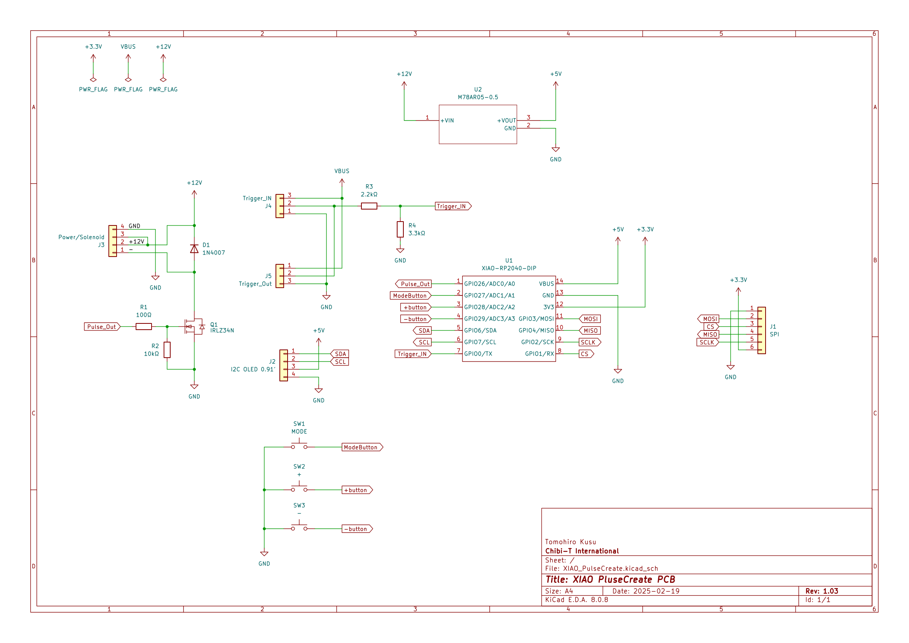

# XIAO Pulse Create

[Seeed Studio XIAO RP2040](https://wiki.seeedstudio.com/XIAO-RP2040/) 向けに PWM パルス信号 (Hi → PWM → Lo サイクル) を生成し、OLED 表示とボタン操作で各時間および Duty を変更・保存できるファームウェアです。  
RP2040 のデュアルコア構成を活用し、Core0 がパルス生成／NeoPixel 制御、Core1 が UI 表示・設定入力・EEPROM 保存を担当します。

## 特長

- 3フェーズ構成のパルス: Hi → PWM → Lo を循環
- PWMフェーズは 25 kHz / 12bit (0-4095) 解像度
- Duty比率を 5%〜95% (設定値) で変更可能
- 3つの時間パラメータ (Hi / PWM / Lo) を個別設定 (ms単位、表示は秒で1桁小数)
- 長押しで EEPROM へ一括保存 (不揮発化)
- NeoPixel による稼働インジケータ (明るさ / ON/OFF)
- SSD1306 (128x32) OLED で残り時間と設定値を同時表示
- デバウンス処理済みのボタン入力
- デバッグ用シリアル出力 (countmode, 各時間, Duty, PWM_RANGE)

## ハードウェア構成

| 信号 | ピン | 方向 | 用途 |
|------|------|------|------|
| pulsePin | D0 | 出力 | パルス (アナログ/PWM) 出力 |
| ModeButton | D1 | 入力(PULLUP) | モード切替 / 保存トリガ |
| PButton | D2 | 入力(PULLUP) | 現在設定値を増加 (+) |
| MButton | D3 | 入力(PULLUP) | 現在設定値を減少 (-) |
| TriggerPin | D6 | 入力(PULLDOWN) | 外部トリガ HIGH:動作開始 / LOW:停止 |
| NeoPixel DIN | 12 | 出力 | NeoPixel制御 |
| NeoPixel 電源制御 | 11 | 出力 | NeoPixel 電源 ON/OFF (直接給電) |
| I2C SDA/SCL | (ボード既定) | 双方向 | SSD1306 128x32 OLED |

回路図例


## 動作モード (countmode)

| 値 | 意味 | 出力 | NeoPixel |
|----|------|------|----------|
| 0 | 停止 | LOW | 消灯 |
| 1 | Hi | 100% (4096) | 明るめ白 (5,5,5) |
| 2 | PWM | Duty比率 (0-4095換算) | 弱め白 (2,2,2) |
| 3 | Lo | LOW | 消灯 |

Core0 ループが state machine をミリ秒単位で切替。

## 時間パラメータ / 範囲 (現コードより)

| 項目 | 変数 | 既定初期値 | 増減ステップ | 最小 | 最大 |
|------|------|------------|--------------|------|------|
| Hi時間 | `hiTime` | 200 ms | 100 ms | 100 ms | 2000 ms |
| PWM時間 | `pwmTime` | 7800 ms | 100 ms | 0 ms | 20000 ms |
| Lo時間 | `loTime` | 500 ms | 100 ms | 500 ms | 2000 ms |
| Duty比率 | `DutyRatio` | 25 % | 5 % | 5 % | 95 % |

表示上は秒換算 (例: 0.2s)。  
残り時間は該当モード中のみカウントダウン表示、他モードでは設定値 (合計時間) を表示。

## 操作方法

| 動作 | 操作 | 説明 |
|------|------|------|
| モード巡回 | Modeボタン短押し | 表示→Hi設定→PWM設定→Lo設定→Duty設定→表示… (setmode 0→1→2→3→4→0) |
| 設定値増加 | +ボタン (PButton) | 現在の設定モードで値増加 (デバウンス 50ms) |
| 設定値減少 | -ボタン (MButton) | 現在の設定モードで値減少 |
| EEPROM保存 | Modeボタン長押し (>1秒) | 現在の全設定 (Hi/PWM/Lo/Duty) を EEPROM に書込し `SAVE!` を約2秒表示 |
| 動作開始/停止 | TriggerPin | HIGH: state machine 動作 / LOW: 即座に停止 (countmode=0) |

### 表示の反転

設定中の項目のみ反転表示 (視覚的フィードバック)。

### 保存表示

`SAVE!` が Lo行の左に 2秒表示。表示後クリア。

## EEPROM

- アドレス配置:
  - 0:Hi
  - sizeof(Hi):PWM
  - sizeof(Hi)+sizeof(PWM):Lo
  - 以降: DutyRatio
- `EEPROM.read(0) != 255` で初期化済み判定 (未使用領域は 0xFF 想定)
- 長押し保存時 `EEPROM.put()` → `EEPROM.commit()`
- 耐久性 (書込回数) への配慮は未実装 (頻繁保存時は要ウェアレベリング)

## NeoPixel インジケータ

- Hi: 明るめ白 (5,5,5)
- PWM: 弱め白 (2,2,2)
- Lo / 停止: 消灯

> 色/明るさは今後カスタマイズ可能。POWER_PIN (11) により電源制御

## ビルド & 書き込み (PlatformIO / Windows)

1. VS Code で本プロジェクトを開く
2. `platformio.ini` のデフォルト環境 (`seeed_xiao_rp2040`) を確認
3. XIAO RP2040 を USB 接続
4. 依存ライブラリは `lib_deps` で自動取得 (初回ビルド時に自動ダウンロード)
5. ビルド → アップロード → シリアルモニタ (115200bps)

```powershell
# (PlatformIO 拡張機能利用時は GUI 操作でも可)
pio run -e seeed_xiao_rp2040
pio run -e seeed_xiao_rp2040 -t upload
pio device monitor -e seeed_xiao_rp2040 -b 115200
```

## デバッグ出力例

```text
2, 200, 7800, 500, 25 / 4096
```

`countmode, hiTime, pwmTime, loTime, DutyRatio / PWM_RANGE` の順。

## 設計 / 仕様補足

| 項目 | 内容 |
|------|----------|
| 外部トリガ (D6) | RP2040に合わせて3.3V レベル入力<BR>ON 中は連続 HIGH。最短 Lo 時間は約 0.5 秒想定<BR>デバウンスはしない（出力側でチャタリング対策済み・レベル監視方式） |
| 出力負荷 | DC12Vソレノイドバルブを `IRLZ34N` (Nch MOSFET, ロジックレベル) 経由で駆動<BR>`pulsePin` はゲート駆動 |
| フライバック保護 | ソレノイド逆起電力対策としてバルブ両端へフライバックダイオード (`1N4007`など) を接続 |
| NeoPixel 電源 | RP2040内で`POWER_PIN` から直接給電 (XIAO RP2040 ピン出力)<BR>高輝度点灯時は大電流が流れるため注意 |
| OLED | 0x3C アドレスの 128x32 SSD1306<BR>モジュール上にプルアップ抵抗実装済み<BR>商品: Amazon [0.91インチ OLEDディスプレイ I2C SSD1306](https://www.amazon.co.jp/dp/B085C67PF1) |
| 対応 MCU | RP2040 のみ |
| Duty 制限 (5–95%) | ソレノイド及び回路の安全余裕確保 (完全 0% / 100% の連続駆動を避ける) 目的 |
| PWM 周波数 25 kHz | ソレノイド特性最適点 + 可聴域回避 |
| EEPROM 初期化判定 | `EEPROM.read(0) != 255` で十分<BR>バージョン管理や署名領域不要 |
| SAVE! 表示 | Lo 行左側に 2 秒表示後クリア |
| トリガ停止挙動 | LOW で即停止し内部タイマーリセット。再 HIGH で Hi フェーズ再開 |
| NeoPixel 色分け | 追加カラー要求なし (白濃淡 + 消灯で十分) |
| 外部通信 | PC からの動的変更機能不要 |

### 安全上の注意 (推奨)

1. ソレノイドの逆起電力抑制ダイオードを必ず実装すること
2. MOSFET ゲートと MCU 間に 10–100 Ω 程度のゲート抵抗 + ゲートプルダウン (100 kΩ 前後) で浮遊防止。
3. ソレノイド電源と MCU 5V/3V3 が異なる場合は GND 共通化し、ノイズ源には TVS / RC スナバを接続。
4. 連続高 Duty (95% 近辺) 使用時はコイル温度上昇モのニタリングを検討すること。

## 今後の改善案

- EEPROM 書込回数低減のための差分保存 / 遅延保存キュー
- 複数プリセット (バンク) 管理
- トリガ入力のエッジ/パルスモード選択 (将来要件化する場合)
- ソレノイド温度・電流簡易モニタ (ADC + しきい値アラート)

## ライセンス

本プロジェクトは MIT License です。  
詳細は `LICENSE` を参照してください。
